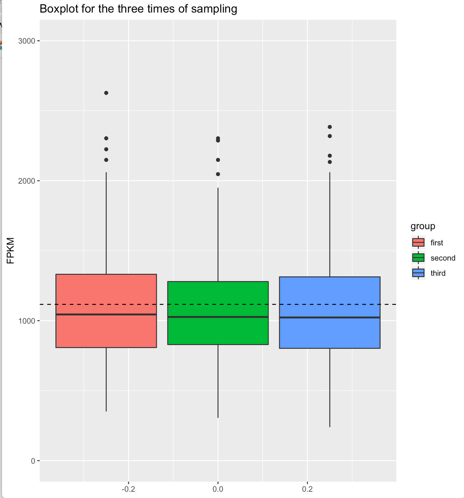
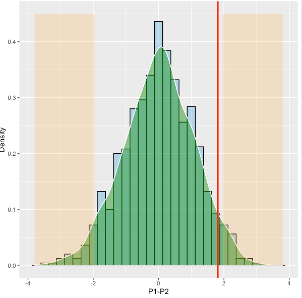
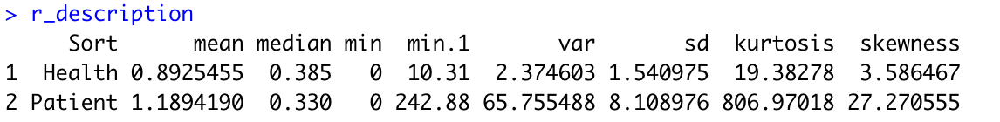
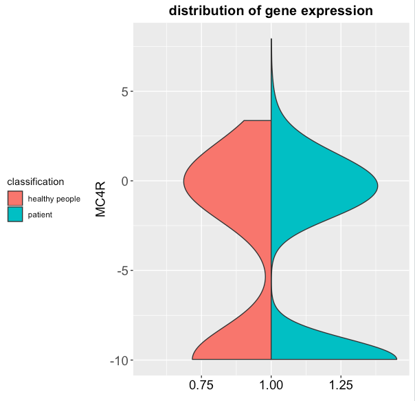
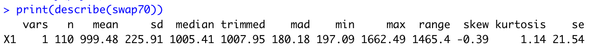
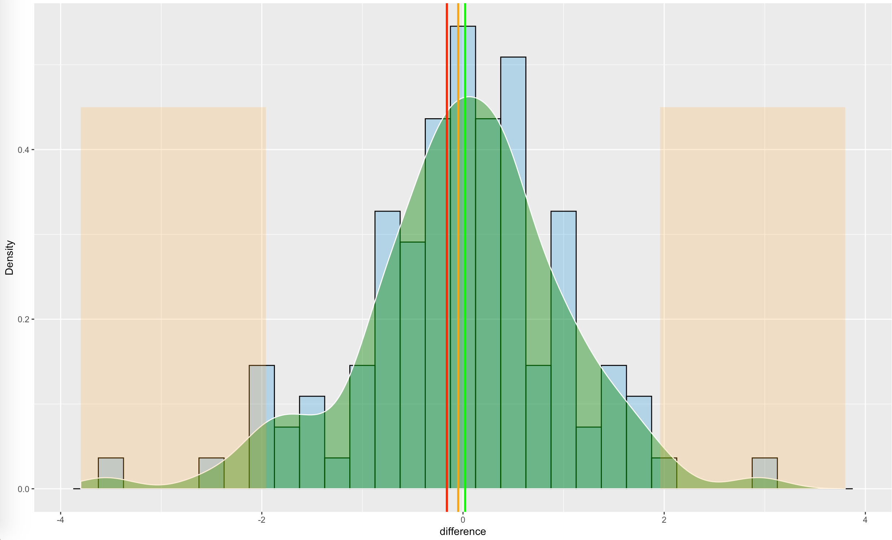
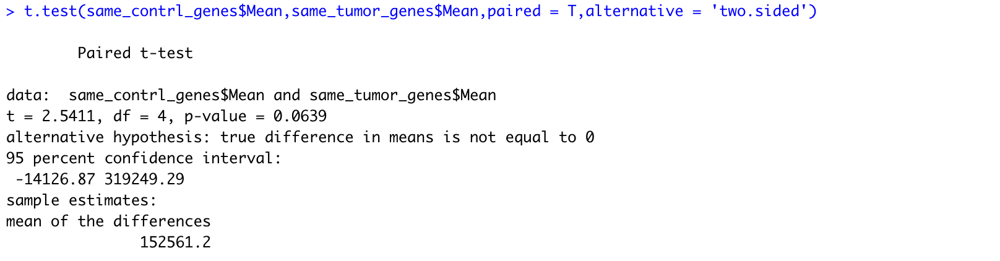
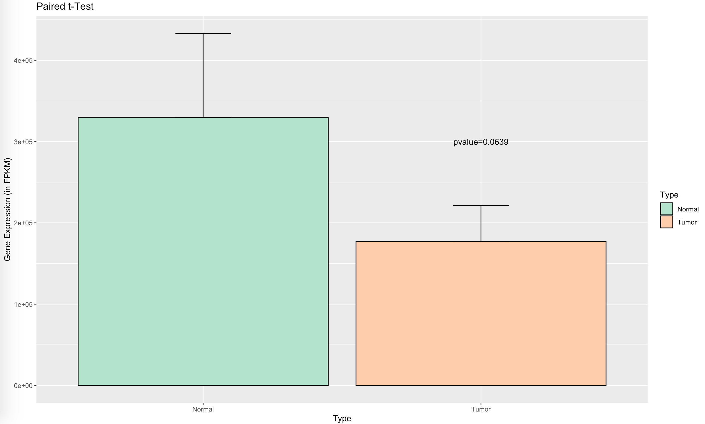
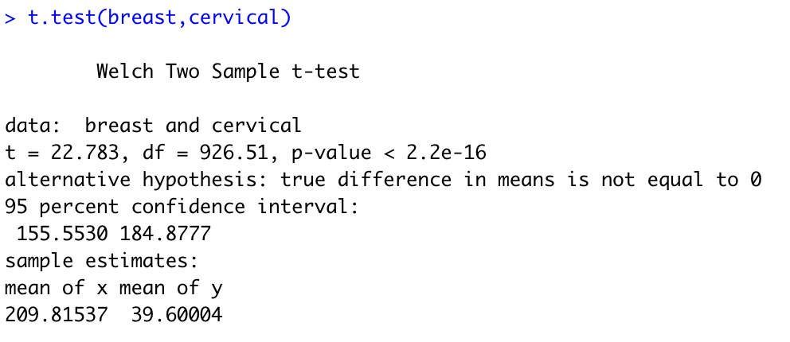
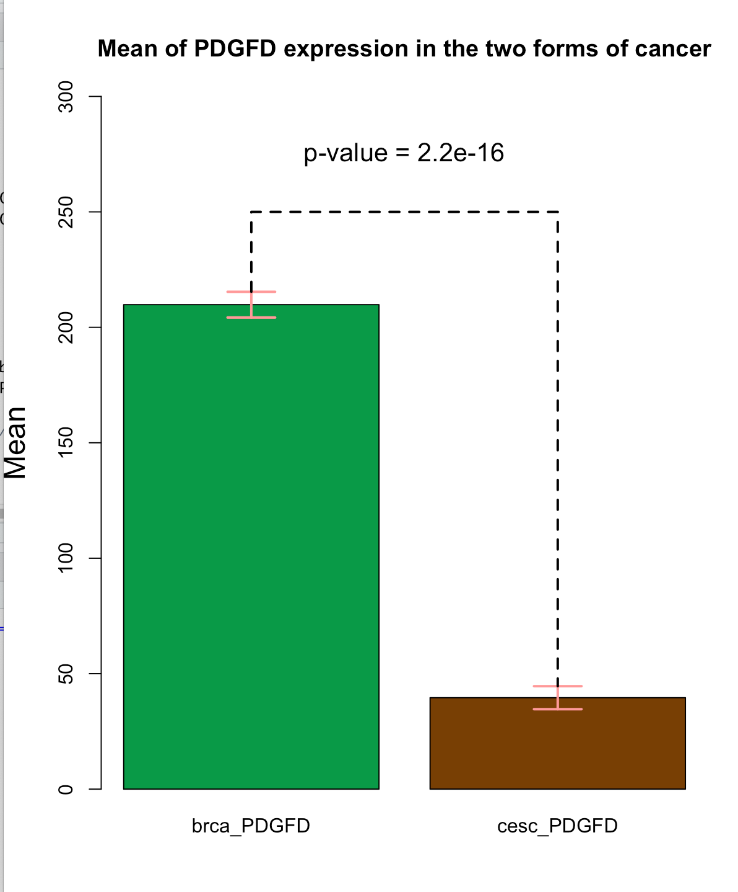

**An experiment is designed to study the pathogenesis of breast cancer. Scientists collected tissues from breast cancer patients and healthy persons (here healthy just means no breast cancer). Totally, 982 tumor samples and 110 control samples were collected, and their corresponding RNA were extracted. After performing RNA-seq and bioinformatic analysis, they got the normalized gene expression levels (FPKM) of all samples. One table showed the FPKM value of tumor samples is named ‘brca-rsemfpkm-tcga-t-lab.txt’, and another table is of control samples named ‘brca-rsem-fpkmtcga-lab.txt’.**


### 第一题

#### 1.Measure the average FPKM of KIF1C gene in tumor samples. And use other descriptive statistics in R to describe the FPKM of KIF1C gene.

```R
# Read data
data<-read.table("brca-rsem-fpkm-tcga-t-lab.txt", header = T)

# Extract data of gene KIF1C
gene<-as.numeric(as.matrix(data[1,2:ncol(data)]))

# Use descriptive statistics in R to describe the FPKM of KIF1C gene
# Average
mean(gene) # 1116.575
#Range
range(gene) # 185.11 6294.04
# Standard deviation
sd(gene) # 500.466
# Median
median(gene) # 1051.79
# Summary 
summary(gene)
# Min. 1st Qu.  Median    Mean 3rd Qu.    Max. 
# 185.1   808.0  1051.8  1116.6  1359.6  6294.0 
# Kurtosis and Skewness
kurtosis(gene) # 18.34869
skewness(gene) # 2.294123
```

#### 2.Randomly take 200 tumor samples, compute the mean of KIF1C genes.

###### Code

```R
#samplesize 200
mean(sample(gene,200))
```

###### 结果

平均值为1137.137

#### 3. Is there a difference between the mean of these 200 tumor samples and the mean of all tumor samples for KIF1C gene, is the difference significant? Use alpha = 0.05

```R
library(BSDA)
sample<-sample(gene,200)
mean(sample)
z<-z.test(sample,alternative = "two.sided", 
          mu = mean(gene), 
          sigma.x = sd(gene), 
          conf.level = 0.95)
z
```

###### 结果


$1111.526\in[1042.166,1180.886]$,故而不能拒绝原假设

#### 4.Repeat steps 2 and 3 above two times, and compare the three results, use graph toshow the differences if possible.  

###### Code

```R
sample1<-sample(gene,200,replace = F)
sample2<-sample(gene,200,replace = F)
sample3<-sample(gene,200,replace = F)
temp<-data.frame(cbind(group=c(rep("first",200),rep("second",200),rep("third",200)),sample=c(sample1,sample2,sample3)))
temp <- data.frame("group"=temp$group,"sample"=as.numeric(as.character(temp$sample)))
plot_boxplot <- ggplot(temp, aes(y =sample,fill = group))
plot_boxplot + 
  geom_boxplot() +
  geom_hline(yintercept = mean(gene), linetype="dashed", color = "black", size=0.5) +
  labs(
    title="Boxplot for the three times of sampling",y="FPKM"
  )+ylim(0,3000)

```

###### 结果



### 第三题

#### 1.Please check whether obese is related to breast cancer, use graph to show the result if possible. Use alpha = 0.05

|            | **肥胖人群** | **非胖人群** | **总数** |
| ---------- | ------------ | ------------ | -------- |
| 乳腺癌人群 | 400(0.4073)  | 582          | 982      |
| 非病人群   | 35(0.3181)   | 75           | 110      |

肥胖概率$p=0.398$
$$
SE=\sqrt{\frac{p\times(1-p)}{n_1}+\frac{p\times(1-p)}{n_2}}=0.0492
$$

$$
Z=\frac{p_1-p_2}{SE}=1.81<1.96
$$

由于z值比1.96小，所以我们无法拒绝原假设，即认为乳腺癌与肥胖无关

###### Code

```R
library(ggplot2)

cal_p_valuie<-function(x,difference)
{
  re<-0
  for(i in x)if(abs(i)>difference)re<-re+1
  return(re/length(x))
}

difference<-400/982-35/110
p<-(400+35)/(982+110)
tmpdata1<-rbinom(n = 1000,size = 982,prob = p)/982
tmpdata2<-rbinom(n = 1000,size = 110,prob = p)/110
mydata<-data.frame(dd=tmpdata1-tmpdata2)
pvalue<-cal_p_valuie(mydata$dd,difference)
mydata$dd<-mydata$dd/sqrt(p*(1-p)*(1/982+1/110))
difference<-difference/sqrt(p*(1-p)*(1/982+1/110))

ggplot(data = NULL)+
  geom_histogram(data = mydata,mapping = aes(x=dd,y=..density..),alpha=0.3,col='black',fill='#009ddF',binwidth = 0.25)+
  geom_density(data = mydata,mapping = aes(x=dd),col='white',alpha=0.5,fill='#03970b')+
  labs(x='P1-P2',y='Density')+
  geom_vline(xintercept = difference,col='red',linetype=1,size=1.2)+
  geom_ribbon(data = NULL,mapping = aes(x = c(-3.8,qnorm(0.025)),ymin=0,ymax=0.45),fill='orange',alpha=0.2)+
  geom_ribbon(data = NULL,mapping = aes(x=c(qnorm(0.975),3.8),ymin=0,ymax=0.45),fill='orange',alpha=0.2)
```

###### 结果



如图所示，橙色部分代表拒绝域，红线代表本题中两个均值的差值，未落在拒绝域内，故而无法拒绝原假设

#### 2.MC4R gene is regarded to related with obesity. Try to extract MC4R expression in breast cancer patients and healthy persons. And save them in one file.

使用sed函数最方便

```bash
sed -n '/MC4R/p' brca-rsem-fpkm-tcga-t-lab.txt > brca-t-lab.txt
sed -n '/MC4R/p' brca-rsem-fpkm-tcga-lab.txt > brca-lab.txt
```

#### 3.Use descriptive statistics in R to describe the MC4R expression value in two groups.

###### Code

```R
library(moments)
health<-read.table("/Users/quyixiang/Desktop/生物统计/lab/lab4/brca-lab.txt",header=F,check.names=FALSE)
health<-as.numeric(c(t(health))[2:111])
patient<-read.table("/Users/quyixiang/Desktop/生物统计/lab/lab4/brca-t-lab.txt",header=F,check.names=FALSE)
patient<-as.numeric(c(t(patient))[3:983])
mean1=mean(health)
mean2=mean(patient)
med1=median(health)
med2=median(patient)
r1=range(health)
r2=range(patient)
v1=var(health)
v2=var(patient)
s1=sd(health)
s2=sd(patient)
summary(health)
summary(patient)
quantile(health)
quantile(patient)
table(health)
table(patient)
prop.table(health)
prop.table(patient)
fivenum(health)
fivenum(patient)
k1=kurtosis(health)
k2=kurtosis(patient)
sk1=skewness(health)
sk2=skewness(patient)
r_description=data.frame(Sort=c('Health','Patient'),mean=c(mean1,mean2),median=c(med1,med2),min=c(r1[1],r2[1]),min=c(r1[2],r2[2]),var=c(v1,v2),sd=c(s1,s2),kurtosis=c(k1,k2),skewness=c(sk1,sk2))
r_description=r_description[-3,]
print(r_description)
```

###### 结果



#### 4.Use violin plot to show the MC4R expression value in two groups.

#####注明：

*** **

在进行小提琴图绘制时，先将数据进行$log_2$转换

###### Code

```R
library(vioplot)
library(ggplot2)
par(mar=c(4,4,1,0))
par(mfrow=c(1,1))

v=data.frame(MC4R=NA,classification=NA )
for (i in 1:length(patient)){
  v[i,1]=log(patient[i]+0.001,2)
  v[i,2]="patient"
}
for (i in (length(patient)+1):(length(patient)+length(health))){
  v[i,1]=log(health[i-length(patient)]+0.001,2)
  v[i,2]="healthy people"
}

ggplot(v, aes(1, MC4R, fill = classification)) + geom_split_violin() +
  xlab(" ") + ylab("MC4R") + 
  ggtitle("distribution of gene expression")+
  theme(legend.position="left", 
        axis.text.x=element_text(colour="black",size=14), 
        axis.text.y=element_text(size=14,face="plain"), 
        axis.title.y=element_text(size = 14,face="plain"),
        axis.title.x=element_text(size = 14,face="plain"), 
        plot.title = element_text(size=15,face="bold",hjust = 0.5))
```

##### 结果




### 第四题

#### 1.Measure the average FPKM of SWAP70 gene in control samples. And use other descriptive statistics in R to describe the FPKM of SWAP70 gene.

#####Code

```R
library(moments)
control <- read.csv("/Users/quyixiang/Desktop/生物统计/lab/lab4/brca-rsem-fpkm-tcga-lab.txt", header = T, sep = "\t")
swap70 <- subset(control, control$Hugo_Symbol == "SWAP70")
swap70 <- as.vector(t(swap70[,-1]))
library(psych)
print(describe(swap70))
```

#####结果

Control组的平均值为999.48

R中其他descriptive statistics对其的描述



####2.Randomly take 50 control samples, compute the mean of SWAP70 genes.

##### Code

```R
sample_health_50<-sample(swap70,50)
mean_sample_health_50<-mean(sample_health_50)
```

##### 结果

取出50个后平均值为0.999

#### 3.Is there a difference between the mean of these 50 control samples and the mean of of all control samples for SWAP70 gene, is the difference significant? Use alpha = 0.05

```R
t_result_50 <- t.test(sample_health_50, swap70)
pvalue_50 <- t_result_50$p.value
```

###### 结果

$pvalue\_50=0.596>0.05$，故而差异不显著

####4.Repeat steps 2 and 3 if sample number in the step 2 is 70, 80, compare the three results, use graph to show the differences if possible.

###### Code

```R
sample_health_70 <- sample(swap70, 70)
mean_70 <- mean(sample_health_70)
t_result_70 <- t.test(sample_health_70, mu = mean_all)
pvalue_70 <- t_result_70$p.value

sample_health_80 <- sample(swap70, 80)
mean_80 <- mean(sample_health_80)
t_result_80 <- t.test(sample_health_80, mu = mean_all)
pvalue_80 <- t_result_80$p.value

pvalue_50
pvalue_70
pvalue_80

#作图
library(ggplot2)

difference_50<-(mean_50-mean_all)/sd
difference_70<-(mean_70-mean_all)/sd
difference_80<-(mean_80-mean_all)/sd

diff=data.frame(name=c("50","70","90"),value=c(difference_50,difference_70,difference_80),col=c("red","orange","green"))

swap70_frame<-data.frame(swap70)
swap70_frame$swap70=(swap70_frame$swap70-mean_all)/sd
ggplot(data = NULL)+
  geom_histogram(data = swap70_frame,mapping = aes(x=swap70,y=..density..),alpha=0.3,col='black',fill='#009ddF',binwidth = 0.25)+
  geom_density(data = swap70_frame,mapping = aes(x=swap70),col='white',alpha=0.5,fill='#03970b')+
  labs(x='difference',y='Density')+
  geom_vline(xintercept = diff$value,col=diff$col,linetype=1,size=1,show.legend=NA)+
  geom_ribbon(data = NULL,mapping = aes(x = c(-3.8,qnorm(0.025)),ymin=0,ymax=0.45),fill='orange',alpha=0.2)+
  geom_ribbon(data = NULL,mapping = aes(x=c(qnorm(0.975),3.8),ymin=0,ymax=0.45),fill='orange',alpha=0.2)
```

###### 结果

$pvalue\_70=0.715>0.05$，故而差异不显著

$pvalue\_80=0.822>0.05$，故而差异不显著




红线、橙线和绿线分别为50、70、90个样本时的值，两侧的橙色区域为拒绝域，由图可知，三条线均为落在拒绝域内，故而差异不显著


### 第五题

#### 1.Measure the average FPKM of each gene in control samples and tumor samples. Sort the gene according to the mean of FPKM from big to small in control samples and tumor samples separately.

######Code

```R
brca_tumor <- read.table('/Users/quyixiang/Desktop/生物统计/lab/lab4/brca-rsem-fpkm-tcga-t-lab.txt',header = T)
brca_contrl <- read.table('/Users/quyixiang/Desktop/生物统计/lab/lab4/brca-rsem-fpkm-tcga-lab.txt',header = T)
brca_contrl_mean <- apply(subset(brca_contrl,select = 2:ncol(brca_contrl)),1,mean)
brca_tumor_mean <- apply(subset(brca_tumor,select = 2:ncol(brca_contrl)),1,mean)
brca_contrl_mean <- cbind(subset(brca_contrl,select=1),as.data.frame(brca_contrl_mean))
brca_tumor_mean <- cbind(subset(brca_tumor,select=1),as.data.frame(brca_tumor_mean))
brca_contrl_mean <- brca_contrl_mean[order(brca_contrl_mean$brca_contrl_mean,decreasing = T),]
brca_tumor_mean <- brca_tumor_mean[order(brca_tumor_mean$brca_tumor_mean,decreasing = T),]
```

#### 2.Extract the same genes in control samples and tumor samples from top 500 genes according to the order in step 1. Use descriptive statistics in R to describe the expression value of extracted genes in two groups.

######Code

```R
genes_in_control <- as.vector(head(brca_contrl_mean,500))
genes_in_tumor <- as.vector(head(brca_tumor_mean,500))
same_contrl_genes <- subset(genes_in_control, genes_in_control$Hugo_Symbol==genes_in_tumor$Hugo_Symbol)
same_tumor_genes <- subset(genes_in_tumor, genes_in_control$Hugo_Symbol==genes_in_tumor$Hugo_Symbol)
summary(genes_in_control$brca_contrl_mean)
summary(genes_in_tumor$brca_tumor_mean)
```


#### 3.For those genes in step 2, is there a difference of their mean of FPKM in two different conditions (control vs tumor). Use alpha = 0.05

######Code

```R
same_contrl_genes <- data.frame(same_contrl_genes,Type = 'Normal')
same_tumor_genes <- data.frame(same_tumor_genes,Type='Tumor')
colnames(same_contrl_genes) <- c('Gene','Mean','Type')
colnames(same_tumor_genes) <- c('Gene','Mean','Type')
same_genes <- rbind(same_contrl_genes,same_tumor_genes)
t.test(same_contrl_genes$Mean,same_tumor_genes$Mean,paired = T,alternative = 'two.sided')
```

###### 结果



#### 4.Draw the error bar plot of the mean of FPKM in two different conditions (control vs tumor) and label pvalue in the graph.

######Code

```R
library(ggplot2)
means <- c(mean(same_contrl_genes$Mean), mean(same_tumor_genes$Mean))
sds <- c(sd(same_contrl_genes$Mean), sd(same_tumor_genes$Mean))
mydf5_4 <- data.frame(Type = c("Normal", "Tumor"), Mean = means, S.D = sds)
ggplot(data = mydf5_4, aes(x = as.factor(Type), y = mydf5_4$Mean,fill=as.factor(Type)))+
  scale_fill_brewer(palette="Pastel2")+
  geom_bar(stat = "identity", position = "dodge",color = 'black',size =0.5)+
  geom_errorbar(stat = "identity",aes(ymin=Mean,ymax = Mean+S.D/sqrt(5)),width=0.2, size=0.5, color="black")+
  labs(title="Paired t-Test") +
  xlab("Type") + labs(fill = 'Type')+
  ylab("Gene Expression (in FPKM)") +
  annotate("text", x = 2, y = 3e5, label = "pvalue=0.0639")
```

###### 结果



###第六题

#### 1.Please measure the mean and variance of PDGFD FPKM in breast cancer and cervical cancer separately. And use other descriptive statistics in R to describe the FPKM of PDGFD gene.

###### Code

```R
breast <- read.csv("/Users/quyixiang/Desktop/生物统计/lab/lab4/brca-rsem-fpkm-tcga-t-lab.txt", header = T, sep = "\t")
breast <- subset(breast, breast$Hugo_Symbol == "PDGFD")
breast <- as.vector(t(breast[,-1]))

cervical <- read.csv("/Users/quyixiang/Desktop/生物统计/lab/lab4/cesc-rsem-fpkm-tcga-t-lab.txt", header = T, sep = "\t")
cervical <- subset(cervical, cervical$Hugo_Symbol == "PDGFD")
cervical <- as.vector(t(cervical[,-1]))

library(psych)
print(describe(breast))
print(describe(cervical))
```


#### 2.Try to judge whether there is difference of PDGFD expression in the two forms of cancer. Use alpha = 0.05

###### Code

```R
t.test(breast,cervical)
```

######结果



因此两个均值并不相等

#### 3.Draw the error bar plot of PDGFD expression in the two forms of cancer, and label pvalue in the graph.

###### Code

$\begin{array}{l}{p=\left(\begin{array}{c}{a+b} \\ {a}\end{array}\right)\left(\begin{array}{c}{c+d} \\ {c}\end{array}\right) /\left(\begin{array}{c}{n} \\ {a+c}\end{array}\right)} {=\frac{(a+b) !(c+d) !(a+c) !(b+d) !}{n ! a ! b ! c ! d !}}\end{array}$

```R
mean_brca_PDGFD<-mean(breast)
mean_cesc_PDGFD<-mean(cervical)

library("plotrix")
SE_brca_PDGFD<-std.error(breast)#计算标准
SE_cesc_PDGFD<-std.error(cervical)

bar_plot<-barplot(c(mean_brca_PDGFD,mean_cesc_PDGFD),
                  beside=T,
                  names.arg =c("brca_PDGFD","cesc_PDGFD"),
                  width =0.1,
                  col=c("#089a47","#783f04"),
                  ylim=c(0,300),
                  
)

title(ylab="Mean",
      main="Mean of PDGFD expression in the two forms of cancer",
      cex.lab=1.5, font.main= 2)

arrows(bar_plot[1], mean_brca_PDGFD - SE_brca_PDGFD,#箭头开始的横纵坐标
       bar_plot[1], mean_brca_PDGFD + SE_brca_PDGFD,
       length=0.2, 
       angle=90,
       code=3,
       lwd=2,
       col="#FF9999")

arrows(bar_plot[2], mean_cesc_PDGFD - SE_cesc_PDGFD,
       bar_plot[2], mean_cesc_PDGFD + SE_cesc_PDGFD, 
       length=0.2, 
       angle=90, 
       code=3,
       lwd=2,
       col="#FF9999")

lines(c(bar_plot[1],bar_plot[1],bar_plot[2],bar_plot[2]),
      c(mean_brca_PDGFD+SE_brca_PDGFD,250,250,mean_cesc_PDGFD+SE_cesc_PDGFD),
      lty=2,lwd=2)
text(x=(bar_plot[1]+bar_plot[2])/2, y=275, 
     label="p-value = 2.2e-16",
     cex=1.3
)
```

###### 结果



