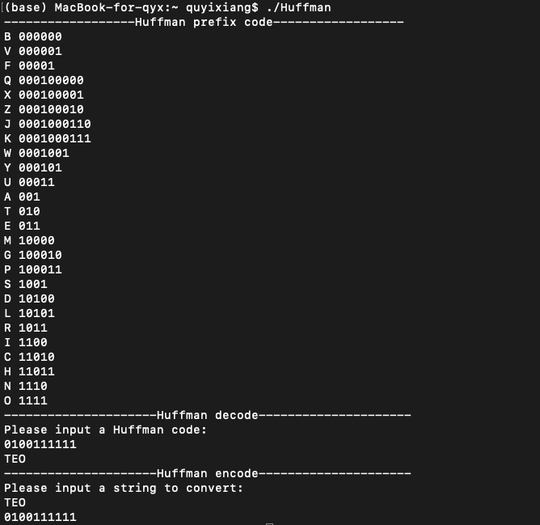

# Huffman

This is the new version to constrct Huffman tree. I use ``min heap`` to make the program run faster.

###Compile

```bash
g++ -o Huffman -std=c++11 ./Huffman.cpp
```

### Input and output


