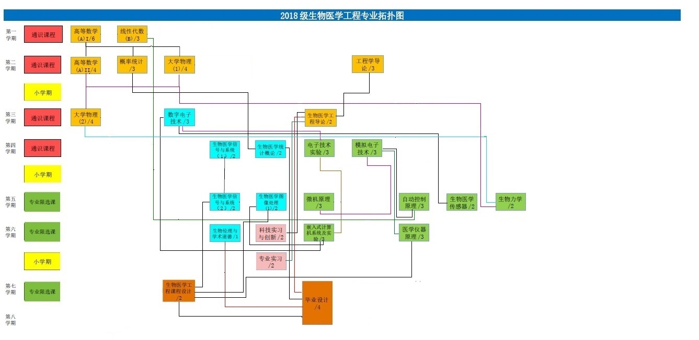

# Topological sort

#### Purpose

This program is aim to solve the following problems.

```
According to the prerequisite relationship between the courses (see the diagram below for the course topology), give suggestions for the course arrangement
```



### Implementation of topological sorting graph

```c++
class TopGraph {
private:
    int vexn; //Number of vertices in the graph
    int edge;   // The number of the edges of the graph
    int * indegree; //Penetration of each edge
    Vnode * arc; //Adjacency list
    stack<int> * SList;//List of stacks
public:
    TopGraph(int, int);
    ~TopGraph();
    //Join node
    void addNode(int, int);
    //Print adjacency list
    void print();
    //Topological sort
    void topological_sort();
};

```

### Implementation of topological sort

##### Main idea

First find the point with a degree of 0 and push it into the stack. When it is out of the stack, print it out and reduce the degree of all subsequent nodes by one. At the same time, check the degree of subsequent nodes. If the degree of input is equal to 0, then go to the next stack and repeat the above steps until all nodes are printed.

```c++
//Sort and print
void TopGraph::topological_sort() {
    int PrintedCount=0;
    int NodeCount=0;
    int StackCount=0;
    int i;
    ArcNode * temp;

    cout << "--------------图的拓扑排序--------------" << endl;
    //Calculate the ingress of each vertex and store it in the indgree array
    for (i = 0; i != this->vexn; i++) {
        temp = this->arc[i].firarc;
        while (temp) {
            ++this->indegree[temp->vexcode];
            temp = temp->next;
        }
    }

    //Traverse the entire tree until each node is printed
    while (PrintedCount!=this->vexn){

        //Only run on first traversal
        if(PrintedCount==0){
            //Put a point with a degree of 0 on the stack
            for(i = 0; i != this->vexn; i++) {
                if (!indegree[i]) {
                    PrintedCount++;
                    cout<<this->arc[i].data<<" ";
                    SList[StackCount].push(i); 
                }
            }
            cout<<endl;
        }

        //Pop all nodes in a stack
        while (!SList[StackCount].empty()){
            i=SList[StackCount].top();
            SList[StackCount].pop();
            temp = this->arc[i].firarc;
            while (temp) {
                //If the degree of entry is reduced to 0, the next stack is entered
                if (!(--this->indegree[temp->vexcode])) {
                    cout<<arc[temp->vexcode].data<<" ";
                    PrintedCount++;
                    SList[StackCount+1].push(temp->vexcode);
                }
                temp=temp->next;
            }
        }

        //Go to the next stack
        StackCount++;
        cout<<endl;
    }
}
```

#### Output


Among them, each line indicates the courses that can be taken at the same time, that is to say, it can be completed as soon as 4 semesters.
