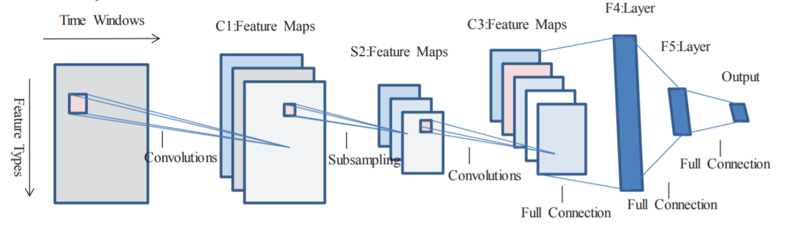
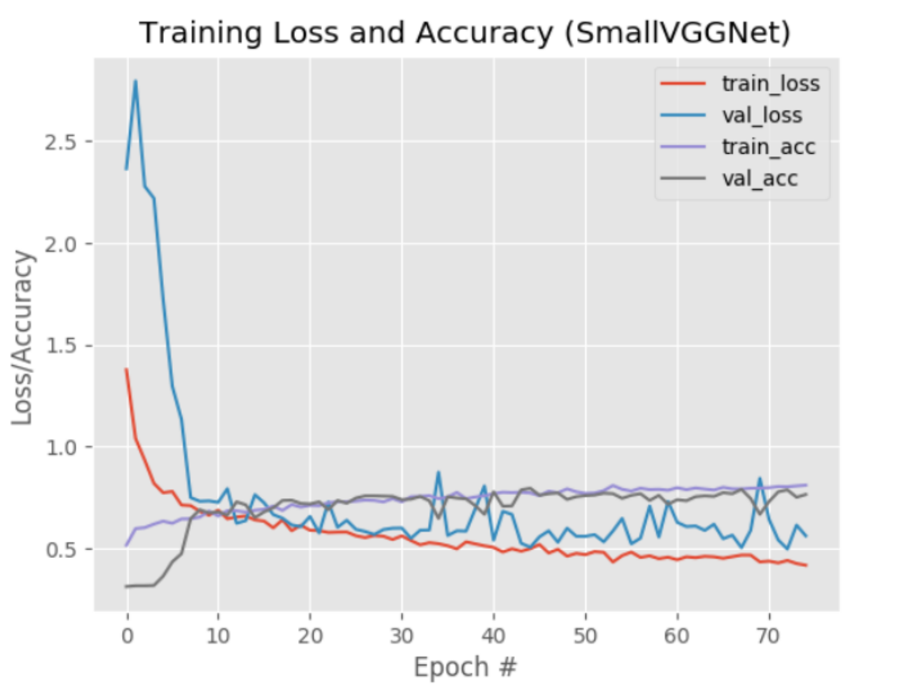

## Binary classification of medical image

### Purpose

Chest radiographs are used to diagnose many conditions involving the chest wall, including its bones, and also structures contained including the lungs, heart, and great vessels. However, it may be really difficult for doctors to classify the images. So it is really important for us to develop a deep learning algorithm to achieve the automatic diagnosis using CNN.

### Dataset

There are two kinds of images in our dataset, effusion and infiltration. There are 203 effusions and 503 infiltrations in our dataset.

### Structure

### Output

``AUC:0.76``
