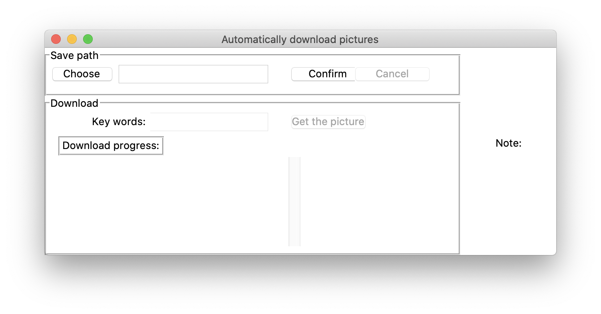

## Python downloader

This script can automatically search for pictures related to the input and download it.

#### User Interface

- Click ``Choose`` and you can choose the storage path in your computer
- Input the ``key words`` you want to search, it will automatically search and download.